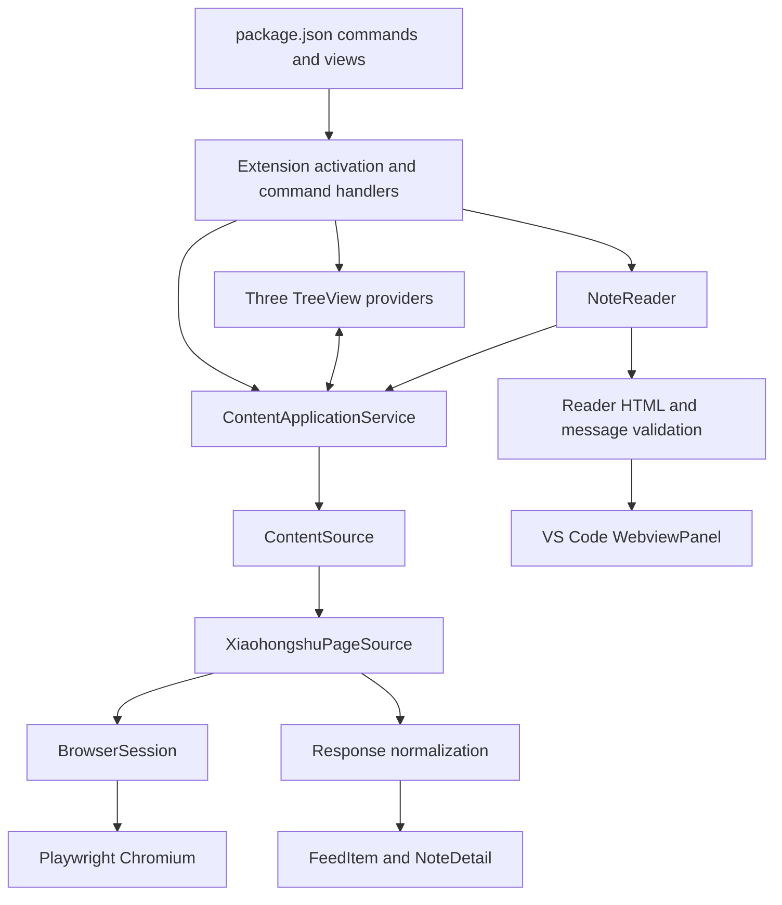
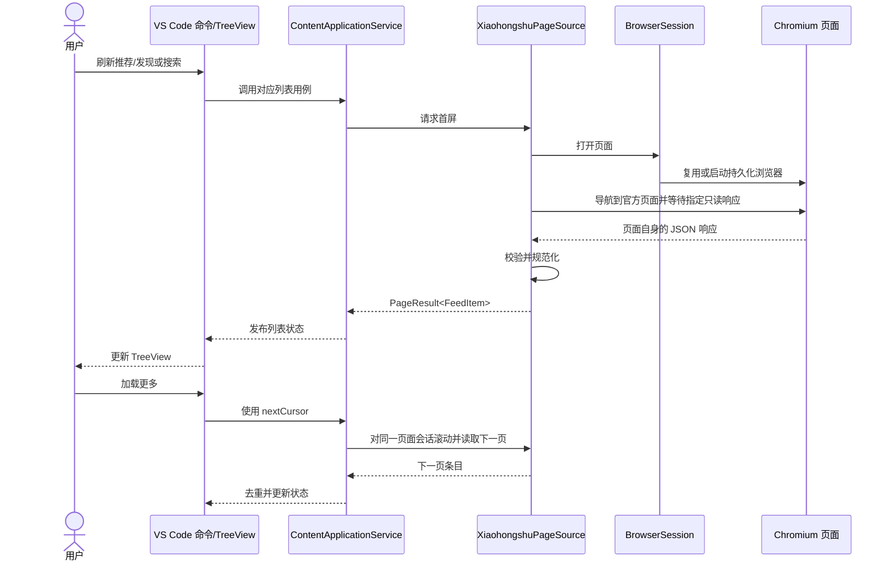
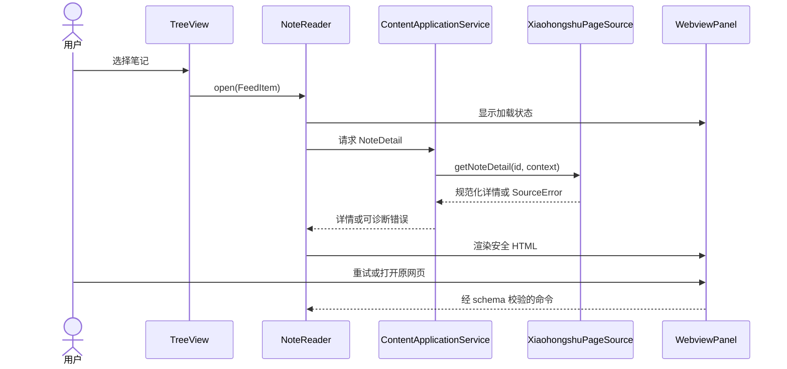

# Xiaohongshu Fisher 架构

本文档描述仓库当前实现的模块边界、数据流和安全约束。产品范围见 [phase-1-features.md](./phase-1-features.md)，社区项目与网页接口调研见 [community-api-research.md](./community-api-research.md)。

## 当前范围

扩展提供推荐、发现、搜索结果三个 TreeView，支持按需刷新、分页、打开笔记阅读页和跳转至小红书官方网页。数据由扩展宿主中的 Playwright 页面适配器读取。当前版本只面向能够启动可见 Chromium 窗口的桌面 VS Code 环境；VS Code Remote SSH、容器和 Web 环境尚未验证。

当前没有发帖、评论、点赞、收藏、关注、私信等互动功能。扩展不会导入用户日常浏览器的 Cookie，也不会自动处理验证码或访问限制。

## 模块关系

`ContentSource` 是页面读取与应用服务之间的边界。当前扩展激活时选择 `XiaohongshuPageSource`；`FakeContentSource` 提供虚构数据，可用于开发和测试，不会自动作为生产数据源启用。

## 模块职责

### 扩展宿主与视图

`src/extension.ts` 创建浏览器会话、网页 source、应用服务、阅读器和三个 TreeView provider，并注册命令。视图只展示应用服务提供的状态和条目；命令层负责 VS Code 输入框、Quick Pick、提示消息和系统浏览器跳转。

三个列表分别维护状态。条目包含标题、可选作者和媒体类型；有下一页游标时显示“加载更多”。

### 应用服务

`src/application/content-service.ts` 负责推荐、发现和搜索列表的请求状态、分页游标、取消、重复请求保护、按 ID 去重和错误归一化。刷新成功后替换首屏数据；加载更多成功后合并数据。它不依赖 Playwright，也不实现持久缓存。

### 数据模型与网页 source

`src/models/content.ts` 定义 `FeedItem`、`NoteDetail`、`MediaItem`、分页结果和会话状态等内部模型。`src/sources/content-source.ts` 定义数据源接口。

`src/sources/xiaohongshu-page-source.ts` 使用小红书官方网页作为浏览入口，并等待该页面自身发出的、路径受限的只读 JSON 响应。推荐和发现入口使用首页与发现页；搜索使用搜索结果页；分页在保留的页面会话中滚动后读取下一次响应；详情通过笔记页面读取。响应仅允许官方小红书域名，限制响应大小，并检查状态和响应结构。它不实现独立的私有 API 签名请求。

`src/sources/normalize.ts` 将网页响应转换为内部模型，过滤缺少实体 ID 或结构不匹配的条目，并校验媒体链接为 HTTPS。平台字段名不应泄漏到 TreeView 或 WebView。

### 浏览器会话

`src/session/browser-session.ts` 通过 Playwright 启动独立、持久化的 Chromium 上下文，profile 存放在 VS Code `globalStorageUri` 下的 `browser-profile` 目录。用户通过官方网页自行登录；“清除会话”会关闭上下文并删除该目录。

当前启动参数为 `headless: false`。因此服务器没有图形桌面或可用 `DISPLAY` 时无法启动浏览器；现有错误处理会将启动异常统一映射为“无法启动独立浏览器”，没有区分图形环境和系统依赖问题。远程无头模式尚未实现。

### 阅读 WebView

`src/webview/note-reader.ts` 复用阅读面板，向应用服务请求笔记详情，并只把规范化详情传给 WebView。详情读取失败时显示错误和官方网页入口。

`src/webview/reader-security.ts` 转义文本，限制图片为允许的小红书/CDN HTTPS 域名，生成带随机 nonce 的 Content Security Policy，并校验 WebView 消息命令。WebView 不接收 Cookie、浏览器对象或原始平台响应，也不加载远程脚本。

## 主要流程

### 刷新列表与翻页

### 打开笔记

## 状态、失败与资源生命周期

- 每个列表独立保留条目、加载状态、游标和错误；刷新失败不清除已有条目。
- 新搜索会取消旧搜索；分页只在有游标且没有同列表请求时执行。
- 页面访问受限、网络失败、解析失败和详情不可用会转为 `SourceError`，不进行自动重试。
- source 关闭其分页页面；扩展释放时关闭浏览器上下文并中止应用层请求。
- 列表及详情目前不写入持久化缓存；正文和媒体不保存到工作区。

## 隐私与安全边界

- 浏览器 profile 仅属于本扩展，不能读取用户默认浏览器 profile。
- 不在普通设置、日志、WebView 消息或仓库 fixture 中保存 Cookie、签名或账号凭据。
- source 只读取官方页面允许域名和指定路径上的只读响应；访问被限制时停止当前读取。
- 笔记链接和图片链接必须通过协议及域名校验；WebView 使用 CSP、文本转义和消息白名单。
- 不增加验证码处理、指纹伪装、代理轮换、自动互动或发布功能。

## 已知限制与后续决策

当前 Playwright 必须能够启动可见窗口。Remote SSH 等远程扩展宿主常常没有图形桌面，因此目前不能承诺远程环境可用。若将远程环境纳入目标，需另行验证无头 Chromium、官方扫码登录 UI、登录状态复用、额外验证时的人工处理，以及浏览器系统依赖与安装体验，再决定是否支持。替代数据 source 也需单独评估，不能将社区项目可运行视为接口稳定或平台授权。

日常依赖、脚本和打包使用 pnpm。核心本地验证为 `pnpm run compile`、`pnpm run lint` 和 `pnpm run test:unit`；完整 VS Code 扩展宿主测试需要可用的图形环境。
